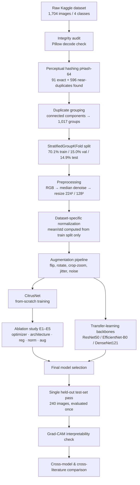
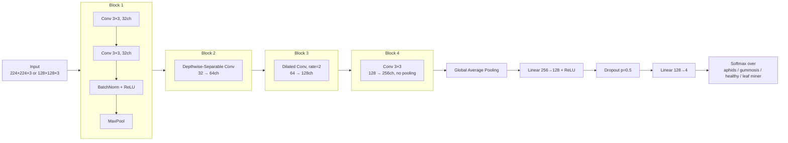

# 🍊 CitrusNet — Citrus Leaf Disease Classification

**A from-scratch lightweight CNN benchmarked against ImageNet transfer-learning backbones for citrus leaf disease/pest classification, with a full data-auditing pipeline, a five-experiment ablation study, and Grad-CAM interpretability.**

> Methodology and Results Report — Subject: Advanced Deep Learning (UAI502)
> Harjot Singh · Pahul Singh — submitted to Dr. Sushma Jain

[]()
[]()
[]()
[]()

---

## Table of Contents

- [Overview](#overview)
- [Results at a Glance](#results-at-a-glance)
- [Pipeline](#pipeline)
- [CitrusNet Architecture](#citrusnet-architecture)
- [Repository Structure](#repository-structure)
- [Getting Started](#getting-started)
  - [1. Clone the repo](#1-clone-the-repo)
  - [2. Set up the environment](#2-set-up-the-environment)
  - [3. Get the dataset](#3-get-the-dataset)
  - [4. Run the pipeline](#4-run-the-pipeline)
- [Dataset & Auditing](#dataset--auditing)
- [Preprocessing & Augmentation](#preprocessing--augmentation)
- [Training Configuration](#training-configuration)
- [Ablation Study (E1–E5)](#ablation-study-e1e5)
- [Transfer Learning Benchmarks](#transfer-learning-benchmarks)
- [Test-Set Results](#test-set-results)
- [Interpretability — Grad-CAM](#interpretability--grad-cam)
- [Comparison with Published Work](#comparison-with-published-work)
- [Deployment Footprint](#deployment-footprint)
- [Limitations & Future Work](#limitations--future-work)
- [Citation](#citation)
- [License](#license)

---

## Overview

This project builds an end-to-end, leakage-safe pipeline for classifying citrus leaf images into four field-observed categories — **aphids, gummosis, healthy, and leaf miner** — and asks a specific question: *how much does ImageNet transfer learning actually buy you over a small, purpose-built CNN on a visually well-separated agricultural task?*

Two model families are trained and evaluated on an identical held-out test set:

1. **CitrusNet** — a **416K-parameter**, from-scratch CNN combining depthwise-separable and dilated convolutions, designed for edge/lightweight deployment.
2. **Three ImageNet-pretrained backbones** — ResNet50, EfficientNet-B0, and DenseNet121 — fine-tuned in two phases (frozen head → full fine-tune) as a transfer-learning baseline.

A rigorous **data-auditing stage** (corruption checks, perceptual-hash near-duplicate detection, group-aware stratified splitting) prevents leakage from burst-style field photography, and a **five-part ablation study** isolates the effect of optimizer, convolution type, regularization, normalization, and augmentation on convergence behavior. **Grad-CAM** is used throughout to verify the models are learning genuine disease symptoms rather than background shortcuts.

---

## Results at a Glance

| Model | Params | Test Accuracy | Macro F1 | Inference Latency | Throughput |
|---|---:|---:|---:|---:|---:|
| **CitrusNet** (from scratch) | **416,036** | 96.67% | 0.9664 | **2.03 ms** | **493 img/s** |
| ResNet50 (transfer) | 23.77M | **99.58%** | 0.9956 | 8.08 ms | 124 img/s |
| DenseNet121 (transfer) | 7.09M | 98.75% | 0.9884 | ~10–15 ms | — |
| EfficientNet-B0 (transfer) | 4.17M | 92.92% | 0.9325 | 21.27 ms | 47 img/s |

**Headline finding:** transfer learning's advantage is *backbone-dependent, not automatic* — ResNet50 and DenseNet121 beat CitrusNet by 2–3 points, but EfficientNet-B0 (unstable frozen-backbone BatchNorm statistics) falls **3.75 points short of it**. CitrusNet is simultaneously the smallest model by more than an order of magnitude and the fastest at inference, making it the practical choice for edge deployment, while the larger backbones are the choice when maximum accuracy is the only priority.

---

## Pipeline



Every stage writes its outputs to disk (metadata CSVs, split manifests, computed normalization stats, checkpoints) so later stages — and this repo, when re-run — never need to re-scan or re-derive earlier results.

---

## CitrusNet Architecture



| Block | Mechanism | Parameters |
|---|---|---:|
| Block 1 | Standard 3×3 conv ×2 + BN + MaxPool | 10,272 |
| Block 2 | Depthwise-separable conv (32→64) | 2,560 |
| Block 3 | Dilated conv, rate 2 (64→128) | 74,112 |
| Block 4 | Standard 3×3 conv (128→256) | 295,680 |
| Classifier head | Linear→ReLU→Dropout→Linear | 33,412 |
| **Total** | | **416,036** (1.59 MB, fp32) |

Weight init: **He/Kaiming** for conv layers and the first FC layer, **Glorot/Xavier** for the output layer. Global average pooling means the network is resolution-agnostic — the same weights run on both the 224² and 128² preprocessed variants used for full vs. fast-ablation runs.

---

## Repository Structure

> Folder/notebook names below mirror the project's actual pipeline stages as described in the accompanying report (`citrus_common.py` is the one module name confirmed directly in the write-up). Rename to match your working tree if it differs.

```
citrus-fruit-classification/
├── data/
│   ├── raw/                     # extracted Kaggle download (aphids/ gummosis/ healthy/ leaf_minnor/)
│   ├── metadata.csv             # filepath, label, dims, size, format, pHash — built once, reused everywhere
│   ├── metadata_split.csv       # + duplicate-group id, split assignment
│   └── processed/               # resized/normalized 224² and 128² tensors per split
├── notebooks/
│   ├── 01_data_audit_and_partitioning.ipynb   # corruption check, pHash, dedup groups, StratifiedGroupKFold
│   ├── 02_preprocessing_and_augmentation.ipynb
│   ├── 03_citrusnet_baseline_training.ipynb
│   ├── 04_ablation_studies.ipynb              # E1–E5
│   ├── 05_transfer_learning.ipynb             # ResNet50 / EfficientNet-B0 / DenseNet121
│   └── 06_evaluation_and_interpretability.ipynb  # test-set pass + Grad-CAM
├── citrus_common.py             # shared dataset/transform module used by every notebook
├── checkpoints/                 # saved .pt weights (baseline + best ablation + backbones)
├── results/
│   ├── figures/                 # loss/accuracy curves, confusion matrices, ROC, Grad-CAM overlays
│   └── metrics/                 # per-run CSV/JSON metrics
├── requirements.txt
└── README.md
```

---

## Getting Started

### 1. Clone the repo

```bash
git clone https://github.com/Harjotsingh0311/citrus-fruit-classification.git
cd citrus-fruit-classification
```

### 2. Set up the environment

```bash
python -m venv .venv
source .venv/bin/activate        # Windows: .venv\Scripts\activate

pip install -r requirements.txt
```

A minimal `requirements.txt` for this pipeline looks like:

```
torch
torchvision
scikit-learn
numpy
pandas
pillow
imagehash
opencv-python
matplotlib
seaborn
grad-cam
tqdm
jupyter
```

Training was run on an **RTX 3050**; a GPU is strongly recommended (CPU forward passes measured ~12× slower in this project) but not required to run the pipeline at reduced batch size.

### 3. Get the dataset

Download the **Kaggle "Citrus-Diseases"** dataset and extract it into `data/raw/`, so that four class folders exist:

```
data/raw/aphids/
data/raw/gummosis/
data/raw/healthy/
data/raw/leaf_minnor/     # note: original folder name, not "leaf_miner"
```

### 4. Run the pipeline

Run the notebooks in order — each one persists its outputs (metadata, splits, checkpoints, metrics) so later stages can be re-run independently once earlier ones have completed:

```bash
jupyter notebook notebooks/01_data_audit_and_partitioning.ipynb
```

1. **Audit & partition** → produces `metadata.csv` / `metadata_split.csv`
2. **Preprocess & augment** → produces `data/processed/`
3. **Train CitrusNet baseline** → produces `checkpoints/citrusnet_baseline.pt`
4. **Run ablations (E1–E5)** → produces `results/metrics/ablation_*.csv`
5. **Fine-tune transfer-learning backbones** → produces `checkpoints/{resnet50,efficientnet_b0,densenet121}.pt`
6. **Evaluate on held-out test set + Grad-CAM** → produces `results/figures/` and final metrics

---

## Dataset & Auditing

| Class | Images | Class Weight (inv. freq.) |
|---|---:|---:|
| Aphids | 416 (285 train) | 0.992 |
| Gummosis | 462 (306 train) | 0.924 |
| Healthy | 367 (238 train) | 1.188 |
| Leaf miner | 459 (302 train) | 0.936 |
| **Total** | **1,704** | imbalance ratio 1.26–1.29 |

- Every image decoded with **Pillow** — zero corrupt files.
- **64-bit perceptual hashing** flagged 91 exact duplicates (dropped) and 596 near-duplicates (Hamming distance ≤ 5), all within-class, consistent with burst photography of the same leaf.
- Duplicate relationships were resolved into **1,017 connected-component groups**; **StratifiedGroupKFold** then split at the *group* level so no near-duplicate photo of the same leaf could appear in two different splits.
- Final split: **1,131 train (70.1%) / 242 val (15.0%) / 240 test (14.9%)**, with per-class proportions held within 14.8–15.1% across all four classes. A group-integrity check confirmed zero cross-split leakage.
- An HSV-threshold leaf-segmentation/crop step (from the original proposal) was implemented but empirically dropped — the dense-foliage orchard backgrounds meant "leaf-like" hues filled the entire frame, so cropping produced no meaningful background isolation. The toggle remains in the code for cleaner-background datasets.

---

## Preprocessing & Augmentation

- RGB conversion → 3×3 median denoise (field-capture sensor noise) → area-interpolation resize to **224×224** (primary) and **128×128** (fast ablations), from source resolutions up to 5712×5712.
- **Dataset-specific normalization**, computed only from the 1,131 training images at 224²:
  `mean = (0.526, 0.516, 0.347)`, `std = (0.215, 0.205, 0.225)` — used in place of generic ImageNet statistics for the from-scratch model.
- Training-time augmentation (applied in order): random horizontal flip (p=0.5) → random rotation (±20°) → random-resized crop (scale 0.8–1.0) → color jitter (±20% brightness/contrast/saturation) → additive Gaussian noise (σ=0.02) → normalize. Validation/test apply only resize + normalize.
- Transfer-learning models instead use standard **ImageNet statistics** (`mean 0.485/0.456/0.406`, `std 0.229/0.224/0.225`), matching the distribution their pretrained filters were learned under.

---

## Training Configuration

**CitrusNet baseline**

| Setting | Value |
|---|---|
| Optimizer | Adam, lr=1×10⁻³, weight decay=1×10⁻⁴ |
| Loss | Class-weighted cross-entropy |
| LR schedule | ReduceLROnPlateau (halve after 3 stale epochs) |
| Batch size | 32 |
| Early stopping | patience 10, max 100 epochs |
| Seed | 42 |
| Result | Stopped at epoch 40; best checkpoint epoch 30 — **val loss 0.0010, val acc 100%** |

**Transfer-learning backbones** (ResNet50 / EfficientNet-B0 / DenseNet121)

| Phase | What's trained | Optimizer | Epochs |
|---|---|---|---|
| Phase 1 | Classifier head only (backbone frozen) | Adam, lr=1×10⁻³ | ≤15, patience 5 |
| Phase 2 | Full network, end-to-end | Adam, lr=1×10⁻⁴, wd=1×10⁻⁴ | ≤50, patience 10 |

A **Grad-CAM interpretability pass** on 12 validation images (all classes) confirmed the 100% validation accuracy reflected genuine symptom localization — insect clusters (aphids), oozing lesions (gummosis), leaf structure (healthy), mining trails (leaf miner) — rather than background shortcut learning.

---

## Ablation Study (E1–E5)

Five experiments isolated one design factor at a time, holding everything else at the baseline configuration. Because validation accuracy is already near-ceiling for this task, **convergence speed and validation-loss magnitude — not final accuracy — are the discriminating signals.**

| Experiment | Factor varied | Winner | Key takeaway |
|---|---|---|---|
| **E1** | Optimizer (SGD±momentum, Adagrad, RMSprop, Adam) | **Adam** | Fastest (99% by epoch 4) and most stable; RMSprop/Adagrad showed sharp loss spikes despite marginally lower best loss |
| **E2** | Convolution type (2×2 factorial: depthwise-sep × dilated) | **Both combined** | Neither mechanism alone was fastest — together they converge in 4 epochs vs. 8–11 individually, a favorable interaction effect |
| **E3** | Regularization (none / dropout / L2 / full) | **Full (dropout+L2+BatchNorm)** | No-regularization had marginally *lower* final loss, but full config converged in 4 epochs vs. 13–21 — regularization here buys speed/stability, not overfitting protection |
| **E4** | Augmentation (on / off) | **Kept on** | Removing augmentation reached a 10× lower final val loss, but was retained for real-world robustness beyond this internal split (deployment-oriented, not metric-driven choice) |
| **E5** | Normalization (none / LayerNorm / WeightNorm / BatchNorm) | **BatchNorm** | Isolated as the true driver of E3's speed gains — 4 epochs to 99% vs. 15–28 for every alternative |

**Selected final configuration** (= the original baseline): Adam · full CitrusNet architecture (depthwise-separable + dilated) · dropout(0.5) + L2(1×10⁻⁴) + BatchNorm · full augmentation.

---

## Transfer Learning Benchmarks

| Backbone | Params | Phase 1 behavior | Best Val Loss | Test Accuracy |
|---|---:|---|---:|---:|
| ResNet50 | 23.77M | Smooth convergence to 100% val acc | <0.001 | **99.58%** (239/240) |
| DenseNet121 | 7.09M | Fastest to 99%+ (by epoch 5) | <0.001 | 98.75% (237/240) |
| EfficientNet-B0 | 4.17M | **Unstable** — val loss spiked to 35.4 despite 80–86% val acc (frozen-backbone BatchNorm statistic mismatch) | plateaued at 94.21% val acc | 92.92% (223/240) |

EfficientNet-B0's instability is consistent with an independent benchmark (Goyal & Lakhwani, 2025), where it was likewise the weakest of four transfer-learning models tested — suggesting a reproducible architectural weakness on small, fine-grained agricultural datasets rather than a pipeline artifact.

---

## Test-Set Results

All four finalized models were evaluated **exactly once** against the same untouched 240-image held-out test set.

| Class | CitrusNet Precision/Recall/F1 |
|---|---|
| Aphids | 1.000 / 1.000 / 1.000 |
| Gummosis | 0.983 / 0.892 / 0.936 |
| Healthy | 0.911 / 1.000 / 0.953 |
| Leaf miner | 0.969 / 0.984 / 0.977 |

- **CitrusNet**: 96.67% accuracy (232/240), macro F1 0.9664, mean per-class ROC-AUC 0.9971.
- All 8 CitrusNet errors involved the **gummosis** class (5 → healthy, 2 → leaf miner, plus 1 leaf-miner → gummosis) — the visually most ambiguous category in this dataset.
- Test accuracy (96.67%) is meaningfully lower than the 100% validation accuracy seen throughout training/ablation — expected, since the same validation set was reused to select the best checkpoint across a dozen+ runs, producing an optimistic validation estimate. The once-only test pass is the unbiased estimate.

---

## Interpretability — Grad-CAM

Grad-CAM was computed against the final convolutional block for both validation and misclassified test images:

- **Correct predictions** consistently localize to the leaf and its specific symptom (insect clusters, lesions, mining trails) rather than background branches/soil.
- **Misclassified examples** revealed two distinct, non-systematic failure modes: one gummosis→healthy error showed attention drifting into background foliage (a genuine shortcut-style error), while a leaf-miner→gummosis error involved a poorly-framed, out-of-focus image where the model's confidence (59%) was appropriately low — rather than confidently wrong.

---

## Comparison with Published Work

| Study | Best model | Best accuracy | Notes |
|---|---|---:|---|
| **This project** | ResNet50 | 99.58% | Full end-to-end fine-tuning (Phase 2 unfreezes entire network) |
| Goyal & Lakhwani (2025) | DenseNet121 / InceptionV3 | 99.12% | Only last 20 layers unfrozen |
| Goyal et al. (2026) — AgriVision-L5 | Custom 5-layer CNN | 92.59% | ~803K params, from scratch |

Two cross-study patterns emerged independently: **(1)** EfficientNet-B0 underperformed in both this project (92.92%) and Goyal & Lakhwani (80.18%) — a reproducible weakness, not a one-off; **(2)** this project's ResNet50 substantially outperformed Goyal & Lakhwani's ResNet50 on the *same architecture* (99.58% vs. 84.58%), plausibly because full end-to-end fine-tuning was used here versus partial (last-20-layer) fine-tuning there — suggesting **fine-tuning depth matters at least as much as backbone choice**. Separately, CitrusNet (416K params, 96.67%) and AgriVision-L5 (~803K params, 92.59%) provide converging evidence that small, purpose-built CNNs can match or approach pretrained backbones on this problem family.

---

## Deployment Footprint

| | CitrusNet | Transfer-learning models |
|---|---:|---:|
| Parameters | 416,036 | 4.17M – 23.77M (17–57× larger) |
| Model size (fp32) | 1.59 MB | — |
| Inference latency (RTX 3050) | 2.03–2.70 ms | 8.08–21.27 ms (4–10× slower) |
| Throughput | 493 img/s | 47–124 img/s |

CitrusNet **dominates** EfficientNet-B0 outright (better accuracy *and* fewer parameters), while ResNet50/DenseNet121 represent a genuine accuracy-for-size-and-latency tradeoff rather than a strict improvement — making the right choice deployment-dependent (edge device vs. server-side maximum accuracy).

---

## Limitations & Future Work

- The validation set is drawn from the **same photographic sessions** as training, so augmentation's robustness benefit for genuinely novel field conditions (new lighting, camera devices, orchard backgrounds) could not be measured from this internal split.
- HSV-based leaf segmentation was not usable on these natural, dense-foliage orchard photos; a learned segmentation/detection front-end could help if extending to more cluttered or multi-leaf scenes.
- All test-set evaluation was a single pass by design (to avoid test-set leakage via repeated checkpoint selection) — a larger, independently collected test set from different orchards/devices would further validate real-world generalization.

---

## Citation

If you use this work, please cite it as:

```bibtex
@techreport{singh2026citrusnet,
  title        = {Citrus Leaf Disease Classification: A From-Scratch CNN Compared Against Transfer-Learning Architectures},
  author       = {Singh, Harjot and Singh, Pahul},
  institution  = {Advanced Deep Learning (UAI502)},
  note         = {Supervised by Dr. Sushma Jain},
  year         = {2026}
}
```

## License

This project is available under the MIT License — add a `LICENSE` file to the repository root if one isn't present yet.
